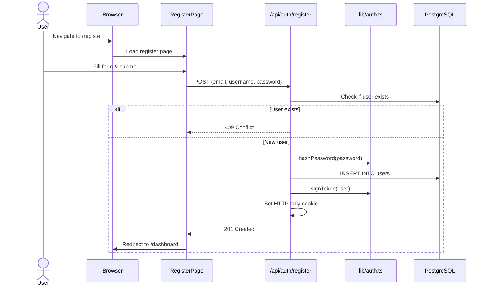
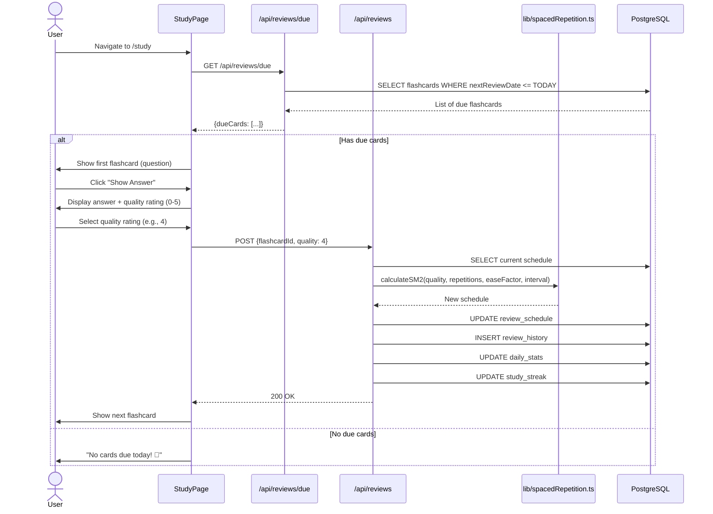
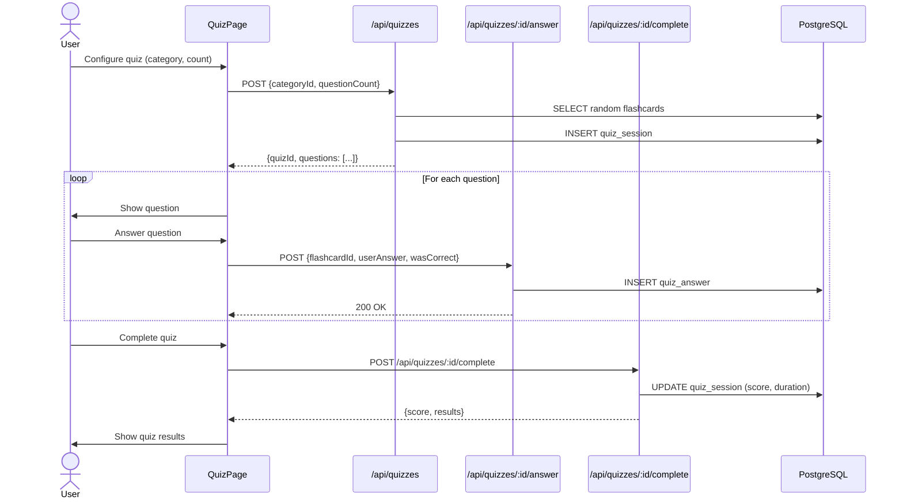
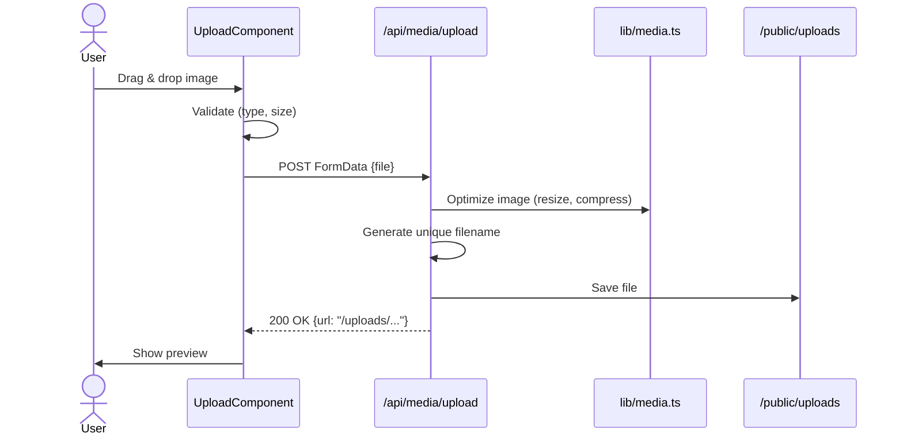
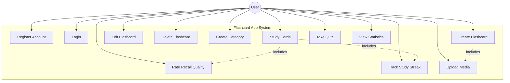

# Flashcard App - Complete Documentation

**Version:** 1.0
**Last Updated:** December 24, 2025
**Framework:** Next.js 14 with App Router

---

## Table of Contents

1. [System Architecture](#system-architecture)
2. [Frontend Framework](#frontend-framework)
3. [Sequence Diagrams](#sequence-diagrams)
4. [Use Case Diagrams](#use-case-diagrams)
5. [Design System](#design-system)

---

# System Architecture

## Overview

The Flashcard App is built using a modern full-stack architecture with Next.js 14, featuring server-side rendering, API routes, and a PostgreSQL database. The application implements the SM-2 spaced repetition algorithm for optimal learning efficiency.

## Architecture Diagram

```
┌─────────────────────────────────────────────────────────────┐
│                        Client (Browser)                      │
│  ┌────────────────────────────────────────────────────────┐ │
│  │              React Components (Client)                  │ │
│  │  • Auth Pages      • Flashcard Forms                   │ │
│  │  • Study Mode      • Quiz Interface                    │ │
│  │  • Dashboard       • Statistics Charts                 │ │
│  └────────────┬───────────────────────────────────────────┘ │
│               │                                              │
│  ┌────────────▼───────────────────────────────────────────┐ │
│  │              State Management Layer                     │ │
│  │  • Zustand Stores (Auth, Flashcards, Study)           │ │
│  │  • TanStack Query (Server State Caching)              │ │
│  └────────────┬───────────────────────────────────────────┘ │
└───────────────┼──────────────────────────────────────────────┘
                │ HTTP/REST
                │
┌───────────────▼──────────────────────────────────────────────┐
│                    Next.js 14 Server                         │
│  ┌──────────────────────────────────────────────────────┐   │
│  │              API Routes (Backend)                     │   │
│  │  /api/auth/*        - Authentication endpoints        │   │
│  │  /api/flashcards/*  - CRUD operations                │   │
│  │  /api/categories/*  - Category management            │   │
│  │  /api/reviews/*     - Study & SM-2 algorithm         │   │
│  │  /api/quizzes/*     - Quiz generation & scoring      │   │
│  │  /api/stats/*       - Analytics & progress           │   │
│  │  /api/media/*       - File upload & serving          │   │
│  └──────────────┬───────────────────────────────────────┘   │
│                 │                                             │
│  ┌──────────────▼───────────────────────────────────────┐   │
│  │           Business Logic Layer                        │   │
│  │  • lib/auth.ts          - JWT & password hashing     │   │
│  │  • lib/spacedRepetition.ts - SM-2 algorithm          │   │
│  │  • lib/validators.ts    - Zod schemas                │   │
│  │  • lib/media.ts         - File processing            │   │
│  └──────────────┬───────────────────────────────────────┘   │
│                 │                                             │
│  ┌──────────────▼───────────────────────────────────────┐   │
│  │              Middleware Layer                         │   │
│  │  • middleware.ts - Route protection                  │   │
│  │  • Auth verification                                 │   │
│  │  • Request logging                                   │   │
│  └──────────────┬───────────────────────────────────────┘   │
└─────────────────┼───────────────────────────────────────────┘
                  │ Prisma ORM
                  │
┌─────────────────▼───────────────────────────────────────────┐
│              PostgreSQL Database (Port 5433)                 │
│  ┌──────────────────────────────────────────────────────┐   │
│  │ Tables:                                               │   │
│  │  • User              - User accounts                  │   │
│  │  • Category          - Flashcard categories           │   │
│  │  • Flashcard         - Questions & answers            │   │
│  │  • ReviewSchedule    - SM-2 algorithm state          │   │
│  │  • ReviewHistory     - Study session logs             │   │
│  │  • QuizSession       - Quiz attempts                  │   │
│  │  • QuizAnswer        - Individual answers             │   │
│  │  • StudyStreak       - Consecutive study days         │   │
│  │  • DailyStat         - Aggregated metrics            │   │
│  └──────────────────────────────────────────────────────┘   │
└──────────────────────────────────────────────────────────────┘
                  │
┌─────────────────▼───────────────────────────────────────────┐
│                    File System                               │
│  /public/uploads/                                            │
│  ├── images/      - User-uploaded images                     │
│  └── audio/       - User-uploaded audio files                │
└──────────────────────────────────────────────────────────────┘
```

## Technology Stack

### Frontend
- **Framework**: Next.js 14 (App Router)
- **Language**: TypeScript
- **Styling**: Tailwind CSS
- **State Management**: Zustand (client state) + TanStack Query (server state)
- **Forms**: React Hook Form + Zod validation
- **Charts**: Recharts
- **Media**: react-dropzone, Howler.js

### Backend
- **Runtime**: Next.js API Routes
- **Database**: PostgreSQL 16
- **ORM**: Prisma
- **Authentication**: JWT + bcrypt
- **File Processing**: Sharp (images)

### Infrastructure
- **Containerization**: Docker Compose
- **Development**: Docker PostgreSQL container
- **Production**: Vercel (app) + Railway/Supabase/Neon (database)

## Database Schema

### Prisma Models

**Core Tables:**
1. **User** - Authentication and user profiles
2. **Category** - Subject organization
3. **Flashcard** - Questions, answers, hints, multimedia URLs
4. **ReviewSchedule** - SM-2 algorithm state (ease factor, interval, next review date)

**Tracking Tables:**
5. **ReviewHistory** - Detailed audit log of every review session
6. **QuizSession** - Quiz metadata (score, duration, completion)
7. **QuizAnswer** - Individual quiz question results
8. **StudyStreak** - Current/longest streak tracking
9. **DailyStat** - Aggregated daily metrics for charts

### Relationships

```
User (1) ──────► (N) Category
User (1) ──────► (N) Flashcard
User (1) ──────► (N) ReviewSchedule
User (1) ──────► (1) StudyStreak

Category (1) ──► (N) Flashcard

Flashcard (1) ─► (1) ReviewSchedule
Flashcard (1) ─► (N) ReviewHistory
Flashcard (1) ─► (N) QuizAnswer

QuizSession (1) ► (N) QuizAnswer
```

## Security Architecture

### Authentication Flow
1. User registers → password hashed → stored in DB
2. User logs in → credentials validated → JWT generated
3. JWT stored in HTTP-only cookie (prevents XSS)
4. Subsequent requests include JWT
5. Middleware validates JWT on protected routes
6. Invalid/expired tokens → redirect to login

### Security Measures
- **Password Security**: bcrypt with 10 rounds
- **Token Security**: JWT with expiration, HTTP-only cookies
- **Input Validation**: Zod schemas on all API endpoints
- **SQL Injection Prevention**: Prisma parameterized queries
- **File Upload Security**: Type/size validation, sanitized filenames

---

# Frontend Framework

## Next.js 14 App Router

### Project Structure

```
app/
├── (auth)/                    # Route group (no URL segment)
│   ├── login/page.tsx        # /login
│   └── register/page.tsx     # /register
│
├── (dashboard)/               # Protected routes group
│   ├── layout.tsx            # Shared dashboard layout
│   ├── page.tsx              # /dashboard
│   ├── flashcards/
│   ├── categories/
│   ├── study/
│   ├── quiz/
│   └── stats/
│
├── api/                       # API Routes (Backend)
│   ├── auth/
│   ├── flashcards/
│   ├── categories/
│   ├── reviews/
│   ├── quizzes/
│   └── stats/
│
├── layout.tsx                 # Root layout
└── page.tsx                   # Landing page (/)

components/
├── ui/                        # Reusable UI primitives
├── flashcard/                 # Flashcard-specific
├── study/                     # Study mode
├── quiz/                      # Quiz components
├── stats/                     # Statistics
├── media/                     # Media handling
└── layout/                    # Layout components

lib/                           # Utility libraries
├── prisma.ts                 # Prisma client
├── auth.ts                   # Auth utilities
├── spacedRepetition.ts       # SM-2 algorithm
└── validators.ts             # Zod schemas
```

## State Management

### Zustand (Client State)
```typescript
// store/authStore.ts
import { create } from 'zustand';

export const useAuthStore = create<AuthState>((set) => ({
  user: null,
  isAuthenticated: false,
  setUser: (user) => set({ user, isAuthenticated: !!user }),
  logout: () => set({ user: null, isAuthenticated: false }),
}));
```

### TanStack Query (Server State)
```typescript
// hooks/useFlashcards.ts
export function useFlashcards(categoryId?: number) {
  return useQuery({
    queryKey: ['flashcards', categoryId],
    queryFn: () => fetchFlashcards(categoryId),
    staleTime: 5 * 60 * 1000, // 5 minutes
  });
}
```

## Forms & Validation

### React Hook Form + Zod
```typescript
// lib/validators.ts
export const flashcardSchema = z.object({
  question: z.string().min(1).max(500),
  answer: z.string().min(1).max(1000),
  categoryId: z.number().optional(),
});

// components/flashcard/flashcard-form.tsx
const { register, handleSubmit } = useForm<FlashcardInput>({
  resolver: zodResolver(flashcardSchema),
});
```

---

# Sequence Diagrams

## 1. User Registration Flow



## 2. Study Session Flow (Spaced Repetition)



## 3. Quiz Flow



## 4. Media Upload Flow



---

# Use Case Diagrams

## Overall System Use Cases



## Use Case Details

### Authentication Use Cases

| Use Case | Actor | Precondition | Postcondition |
|----------|-------|--------------|---------------|
| Register Account | Guest | User not logged in | User account created, JWT issued, redirected to dashboard |
| Login | Guest | User has account | JWT issued, session started, redirected to dashboard |
| Logout | User | User logged in | Session ended, JWT removed, redirected to landing page |

### Flashcard Management Use Cases

| Use Case | Actor | Precondition | Postcondition |
|----------|-------|--------------|---------------|
| Create Flashcard | User | User logged in | New flashcard created, ReviewSchedule initialized |
| Edit Flashcard | User | Flashcard exists, user is owner | Flashcard updated in database |
| Delete Flashcard | User | Flashcard exists, user is owner | Flashcard and related data deleted |
| Upload Media | User | Creating/editing flashcard | Image/audio optimized, saved, URL returned |

### Study Mode Use Cases

| Use Case | Actor | Precondition | Postcondition |
|----------|-------|--------------|---------------|
| Start Study Session | User | User logged in, has flashcards | Display cards due for review |
| View Due Cards | User | ReviewSchedule exists | List of due flashcards shown |
| Flip Flashcard | User | Viewing question | Answer revealed with media |
| Rate Recall Quality | User | Viewed answer | Schedule updated via SM-2, history recorded |
| Complete Session | User | All due cards reviewed | Session summary shown, streak updated |

### Quiz Mode Use Cases

| Use Case | Actor | Precondition | Postcondition |
|----------|-------|--------------|---------------|
| Start Quiz | User | Quiz configured | QuizSession created, questions loaded |
| Answer Question | User | Quiz in progress | User submits answer |
| Complete Quiz | User | All questions answered | Final score calculated and saved |
| View Results | User | Quiz completed | Results summary displayed with breakdown |

### Statistics Use Cases

| Use Case | Actor | Precondition | Postcondition |
|----------|-------|--------------|---------------|
| View Dashboard | User | User logged in | Overview stats displayed (cards due, streak, accuracy) |
| View Study Streak | User | Has review history | Current and longest streak displayed |
| View Charts | User | Has historical data | Visual graphs of progress over time |

## Actor Definitions

| Actor | Description |
|-------|-------------|
| **Guest User** | Unauthenticated visitor, can only access public pages |
| **User** | Authenticated user, has access to all features |
| **Student** | User actively studying or taking quizzes |
| **System** | Automated processes (SM-2 algorithm, streak calculator) |

## Use Case Priorities

### High Priority (MVP)
1. ✅ User authentication
2. ✅ Create/edit/delete flashcards
3. ✅ Study mode with spaced repetition (SM-2)
4. ✅ Rate recall quality
5. ✅ View basic statistics

### Medium Priority
1. ✅ Quiz mode
2. ✅ Detailed statistics and charts
3. ✅ Study streak tracking
4. ✅ Media upload (images, audio)
5. Search and filter flashcards

### Low Priority (Future)
1. Export/import flashcards
2. Share decks with other users
3. Mobile app
4. AI-generated flashcards
5. Gamification

---

# Design System

## Design Principles

1. **Clarity** - Clear visual hierarchy, obvious call-to-actions
2. **Consistency** - Unified component library, predictable interactions
3. **Efficiency** - Fast loading, minimal clicks, keyboard shortcuts
4. **Accessibility** - WCAG 2.1 AA compliance, keyboard navigation
5. **Delight** - Smooth animations, satisfying interactions

## Color Palette

### Primary Colors

```css
/* Primary - Indigo (Focus, Learning) */
--primary-500: #6366f1;  /* Main primary */
--primary-600: #4f46e5;
--primary-700: #4338ca;

/* Secondary - Sky Blue (Success, Progress) */
--secondary-500: #0ea5e9;  /* Main secondary */
--secondary-600: #0284c7;
```

### Semantic Colors

```css
/* Success - Green */
--success: #10b981;
--success-dark: #065f46;

/* Warning - Amber */
--warning: #f59e0b;
--warning-dark: #92400e;

/* Error - Red */
--error: #ef4444;
--error-dark: #991b1b;

/* Info - Blue */
--info: #3b82f6;
--info-dark: #1e3a8a;
```

### Neutral Colors

```css
/* Grays */
--gray-100: #f3f4f6;
--gray-200: #e5e7eb;
--gray-300: #d1d5db;
--gray-500: #6b7280;
--gray-700: #374151;
--gray-900: #111827;
```

## Typography

### Font Scale

```css
.text-h1 { font-size: 3rem;    /* 48px */ font-weight: 700; }
.text-h2 { font-size: 2.25rem; /* 36px */ font-weight: 700; }
.text-h3 { font-size: 1.875rem;/* 30px */ font-weight: 600; }
.text-h4 { font-size: 1.5rem;  /* 24px */ font-weight: 600; }
.text-base{ font-size: 1rem;   /* 16px */ line-height: 1.5; }
.text-sm  { font-size: 0.875rem;/* 14px */ line-height: 1.5; }
```

## Component Library

### Buttons

```html
<!-- Primary Button -->
<button class="px-6 py-3 bg-indigo-600 text-white font-semibold rounded-lg hover:bg-indigo-700 transition">
  Create Flashcard
</button>

<!-- Secondary Button -->
<button class="px-6 py-3 bg-white text-indigo-600 font-semibold rounded-lg border-2 border-indigo-600 hover:bg-indigo-50 transition">
  Cancel
</button>

<!-- Ghost Button -->
<button class="px-4 py-2 text-gray-700 font-medium rounded-lg hover:bg-gray-100 transition">
  View Details
</button>
```

### Cards

```html
<!-- Base Card -->
<div class="bg-white rounded-lg shadow-sm border border-gray-200 p-6">
  <!-- Card content -->
</div>

<!-- Interactive Card -->
<div class="bg-white rounded-lg shadow-sm border border-gray-200 p-6 hover:shadow-md hover:border-indigo-300 transition cursor-pointer">
  <!-- Card content -->
</div>
```

### Forms

```html
<!-- Text Input -->
<div class="space-y-2">
  <label class="block text-sm font-medium text-gray-700">Question</label>
  <input
    type="text"
    class="w-full px-4 py-2 border border-gray-300 rounded-lg focus:ring-2 focus:ring-indigo-500"
    placeholder="Enter your question"
  />
</div>

<!-- Textarea -->
<textarea
  class="w-full px-4 py-3 border border-gray-300 rounded-lg focus:ring-2 focus:ring-indigo-500 resize-none"
  rows="4"
  placeholder="Enter your answer"
></textarea>
```

### Badges

```html
<!-- Success Badge -->
<span class="px-3 py-1 rounded-full text-sm font-medium bg-green-100 text-green-800">
  Correct
</span>

<!-- Error Badge -->
<span class="px-3 py-1 rounded-full text-sm font-medium bg-red-100 text-red-800">
  Incorrect
</span>
```

### Modals

```html
<div class="fixed inset-0 bg-black bg-opacity-50 flex items-center justify-center z-50">
  <div class="bg-white rounded-lg shadow-xl max-w-md w-full p-6 space-y-4">
    <div class="flex items-center justify-between">
      <h3 class="text-lg font-semibold">Modal Title</h3>
      <button class="p-1 text-gray-400 hover:text-gray-600">✕</button>
    </div>
    <div class="text-gray-600">Modal content</div>
    <div class="flex gap-3 justify-end">
      <button class="px-4 py-2 text-gray-700 hover:bg-gray-100 rounded-lg">Cancel</button>
      <button class="px-4 py-2 bg-indigo-600 text-white hover:bg-indigo-700 rounded-lg">Confirm</button>
    </div>
  </div>
</div>
```

### Loading States

```html
<!-- Spinner -->
<div class="animate-spin rounded-full h-8 w-8 border-b-2 border-indigo-600"></div>

<!-- Progress Bar -->
<div class="w-full bg-gray-200 rounded-full h-2">
  <div class="bg-indigo-600 h-2 rounded-full" style="width: 60%"></div>
</div>
```

## Layout Patterns

### Dashboard Layout

```
┌─────────────────────────────────────────────────┐
│ Header (Logo, Nav, User Menu)                   │
├──────────┬──────────────────────────────────────┤
│          │                                       │
│ Sidebar  │  Main Content Area                   │
│          │  ┌────────────────────────────────┐  │
│ • Home   │  │ Stats Cards                    │  │
│ • Study  │  ├────────────────────────────────┤  │
│ • Quiz   │  │ Charts                         │  │
│ • Cards  │  ├────────────────────────────────┤  │
│ • Stats  │  │ Recent Activity                │  │
│          │  └────────────────────────────────┘  │
└──────────┴───────────────────────────────────────┘
```

### Study Mode Layout

```
┌─────────────────────────────────────────────────┐
│ Progress: 5/20 cards reviewed                   │
├─────────────────────────────────────────────────┤
│                                                  │
│         ┌───────────────────────────┐           │
│         │                           │           │
│         │   Flashcard               │           │
│         │   (Flip Animation)        │           │
│         │                           │           │
│         └───────────────────────────┘           │
│                                                  │
│   [Show Answer] or Quality Rating (0-5)        │
│                                                  │
└─────────────────────────────────────────────────┘
```

## Animations

### Flashcard Flip Animation

```css
.flip-card {
  perspective: 1000px;
}

.flip-card-inner {
  transition: transform 0.6s;
  transform-style: preserve-3d;
}

.flip-card.flipped .flip-card-inner {
  transform: rotateY(180deg);
}

.flip-card-front,
.flip-card-back {
  backface-visibility: hidden;
}

.flip-card-back {
  transform: rotateY(180deg);
}
```

### Transitions

```css
/* Default transition */
transition: all 0.2s ease-in-out;

/* Hover lift effect */
.hover-lift:hover {
  transform: translateY(-2px);
  box-shadow: 0 10px 20px rgba(0, 0, 0, 0.1);
}
```

## Responsive Breakpoints

```css
/* Mobile First */
/* Default: < 640px (mobile) */
@media (min-width: 640px) { /* sm - tablets */ }
@media (min-width: 768px) { /* md - tablets */ }
@media (min-width: 1024px) { /* lg - laptops */ }
@media (min-width: 1280px) { /* xl - desktops */ }
```

## Accessibility Guidelines

### Color Contrast
- **Normal text**: 4.5:1 minimum
- **Large text (18px+)**: 3:1 minimum
- **Interactive elements**: 3:1 minimum

### Focus States
```css
.focus-visible:focus {
  outline: 2px solid #4f46e5;
  outline-offset: 2px;
}
```

### Keyboard Navigation
- **Tab**: Move focus forward
- **Shift+Tab**: Move focus backward
- **Enter/Space**: Activate button
- **Escape**: Close modal
- **Arrow keys**: Navigate lists

---

## Viewing Diagrams

All diagrams in this documentation use **Mermaid** syntax.

### How to View:

1. **GitHub**: Diagrams render automatically
2. **VSCode**: Install "Markdown Preview Mermaid Support" extension
3. **Online**: Copy to [mermaid.live](https://mermaid.live)

---

**End of Documentation**
