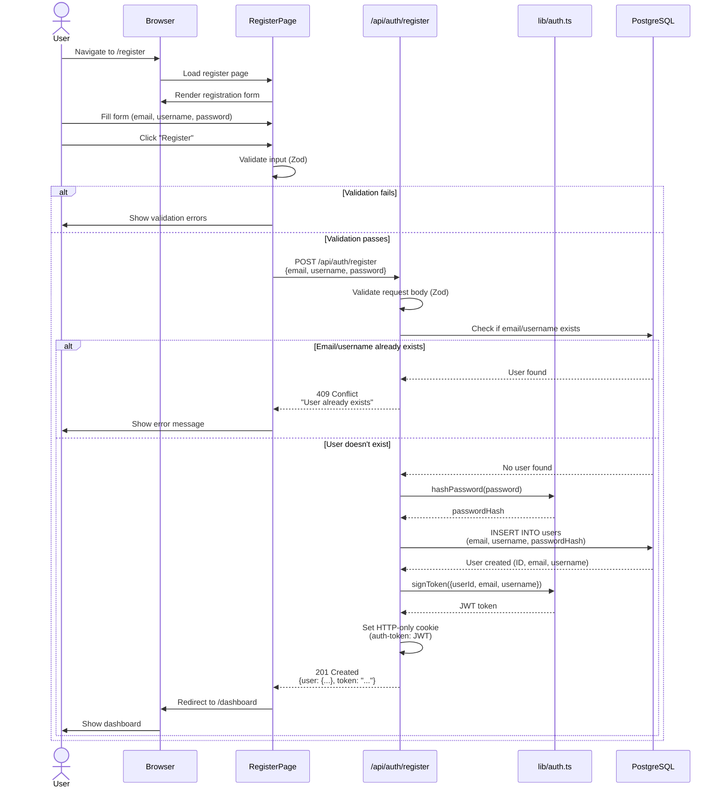
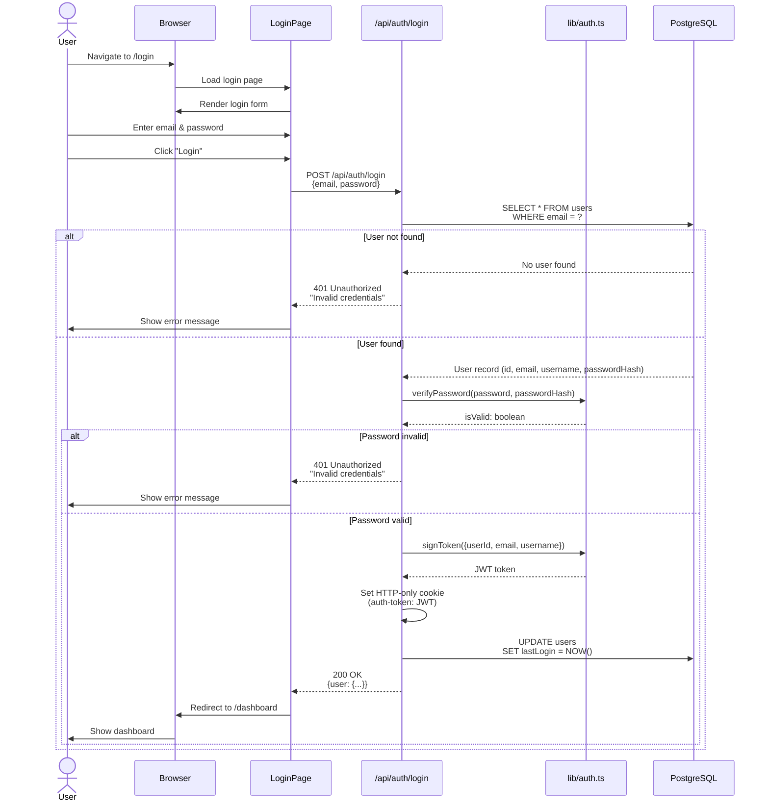
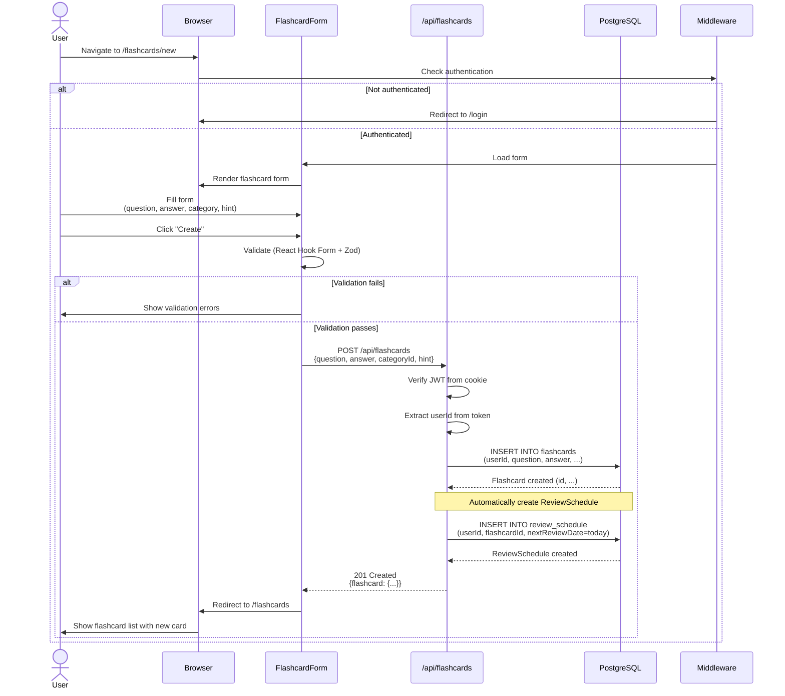
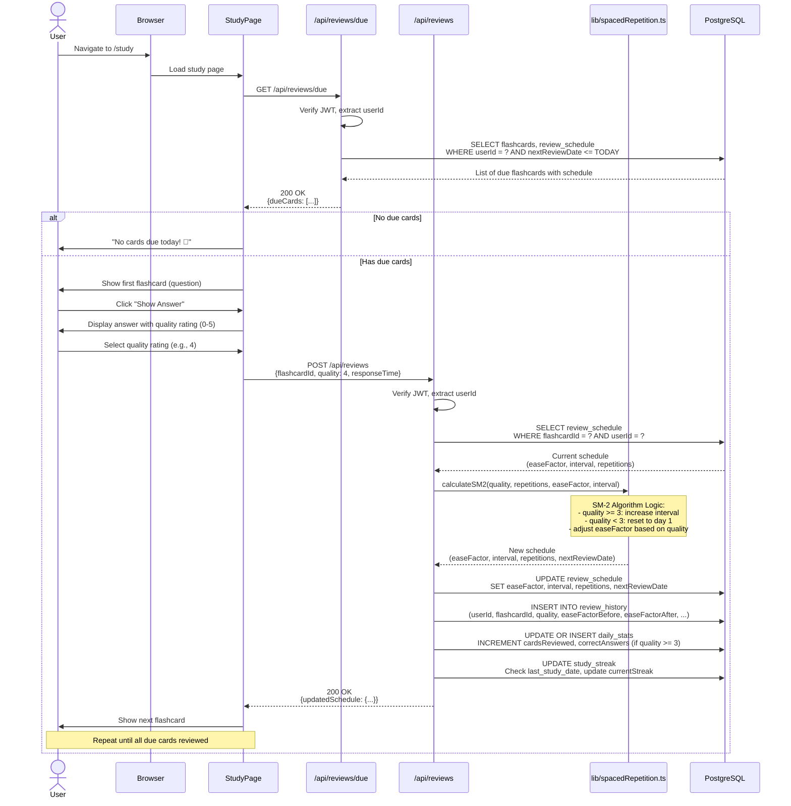
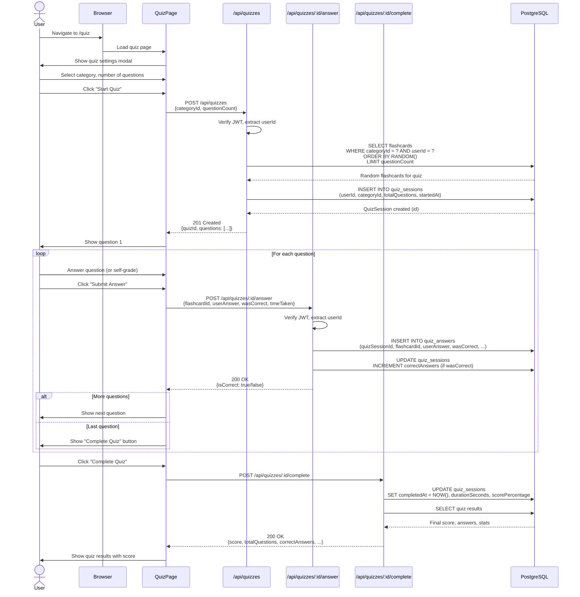
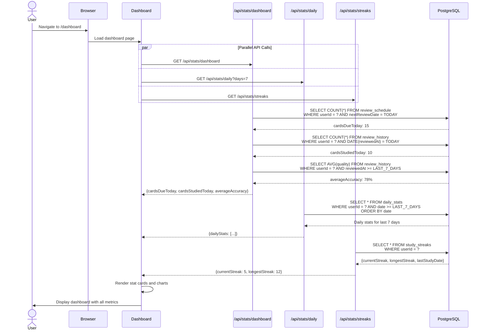
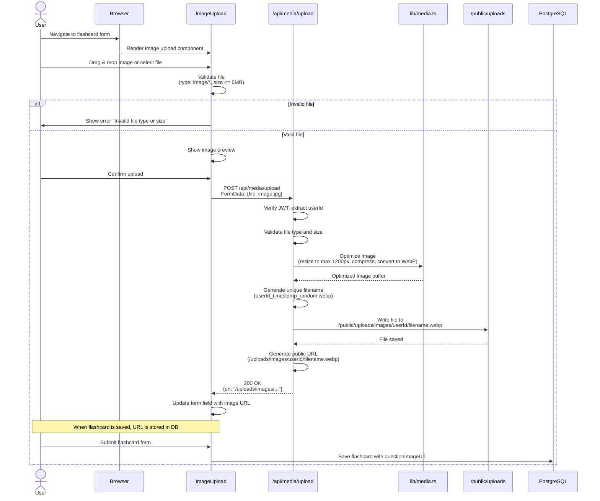
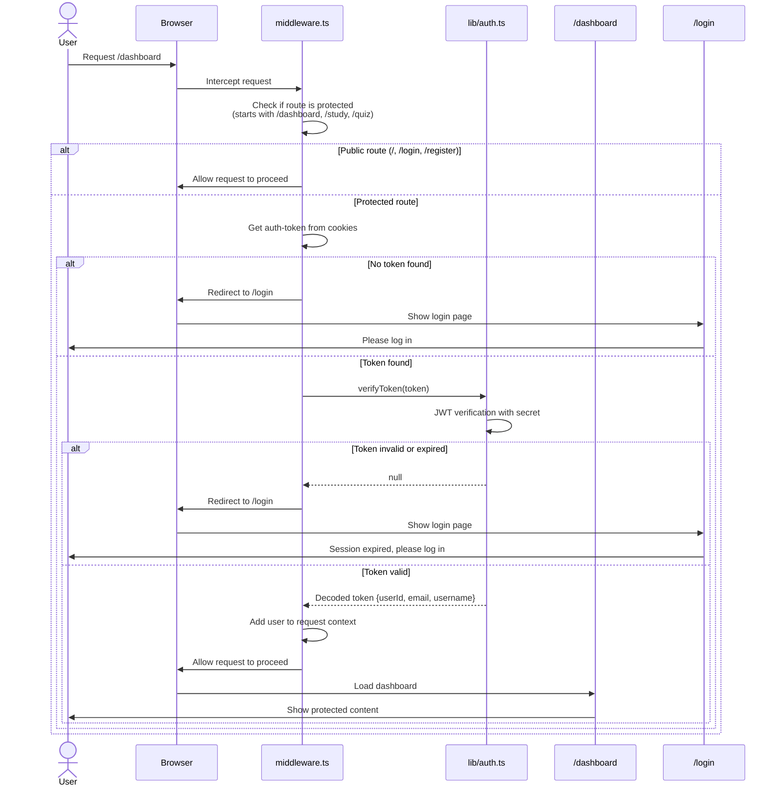

# Sequence Diagrams

This document contains sequence diagrams for key user flows in the Flashcard App. Diagrams are written in Mermaid syntax and can be rendered in GitHub, VSCode (with Mermaid extension), or any Mermaid-compatible viewer.

## 1. User Registration Flow

## 2. User Login Flow

## 3. Create Flashcard Flow

## 4. Study Session Flow (Spaced Repetition)

## 5. Quiz Flow

## 6. Dashboard Statistics Flow

## 7. Media Upload Flow

## 8. Authentication Middleware Flow

## Notes

- All diagrams use **Mermaid** syntax
- To view diagrams:
  - GitHub: Renders automatically in `.md` files
  - VSCode: Install "Markdown Preview Mermaid Support" extension
  - Online: Copy to [mermaid.live](https://mermaid.live)

- Key patterns:
  - ✅ All API calls verify JWT authentication
  - ✅ Database operations extract userId from JWT
  - ✅ Validation happens both client-side (UX) and server-side (security)
  - ✅ Optimistic updates improve perceived performance
