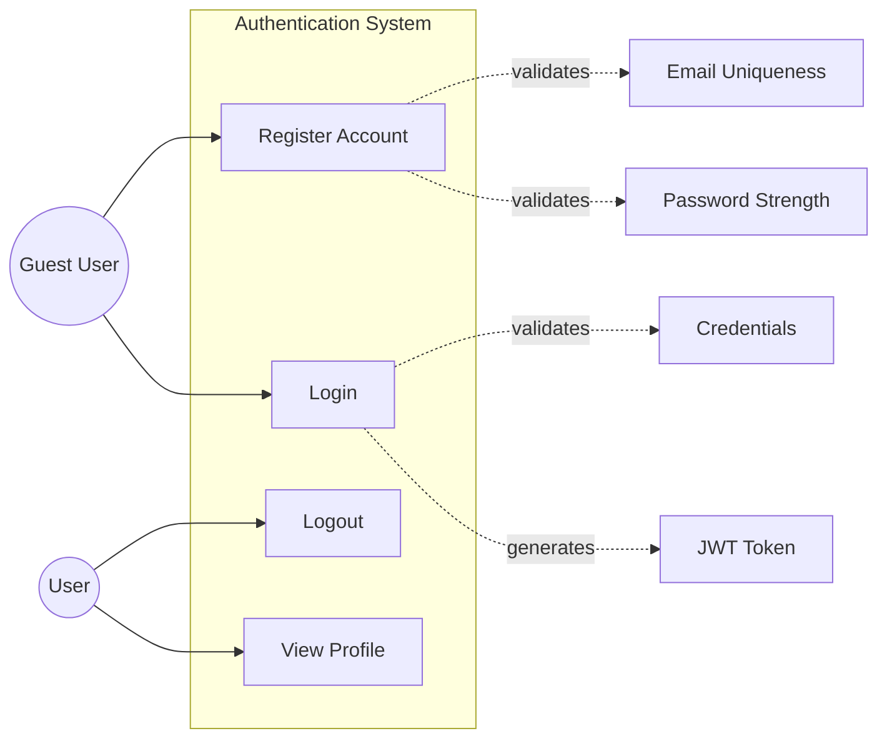
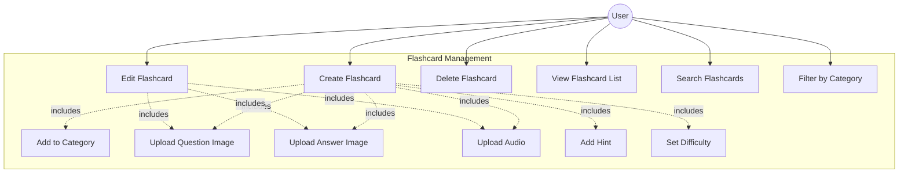
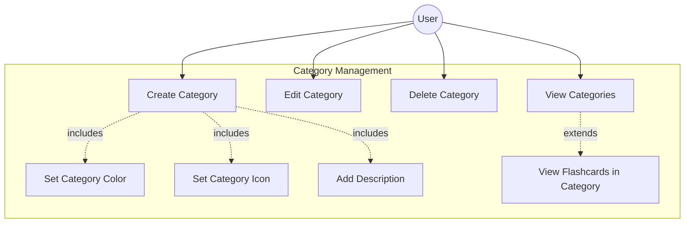
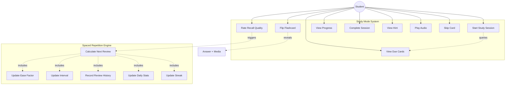
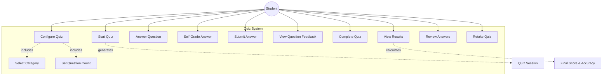
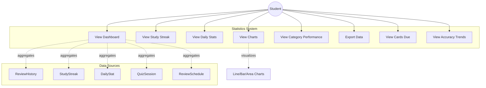
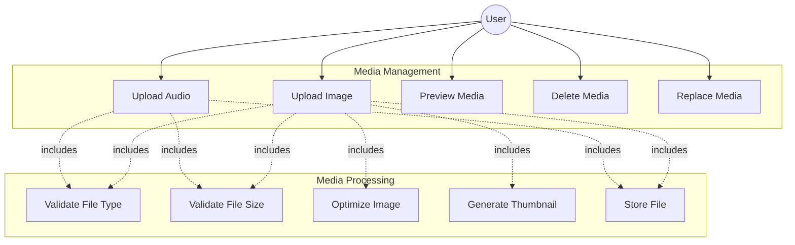
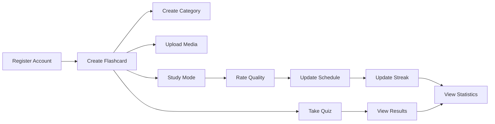

# Use Case Diagrams

This document contains use case diagrams for the Flashcard App, showing the interactions between users and the system. Diagrams are written in Mermaid syntax.

## Overall System Use Case Diagram

```mermaid
graph TB
    User((User))

    subgraph "Flashcard App System"
        UC1[Register Account]
        UC2[Login]
        UC3[Logout]
        UC4[Create Flashcard]
        UC5[Edit Flashcard]
        UC6[Delete Flashcard]
        UC7[View Flashcards]
        UC8[Search Flashcards]
        UC9[Create Category]
        UC10[Manage Categories]
        UC11[Study Cards]
        UC12[Rate Recall Quality]
        UC13[Take Quiz]
        UC14[View Quiz Results]
        UC15[View Statistics]
        UC16[Track Study Streak]
        UC17[Upload Images]
        UC18[Upload Audio]
        UC19[View Dashboard]
    end

    User --> UC1
    User --> UC2
    User --> UC3
    User --> UC4
    User --> UC5
    User --> UC6
    User --> UC7
    User --> UC8
    User --> UC9
    User --> UC10
    User --> UC11
    User --> UC12
    User --> UC13
    User --> UC14
    User --> UC15
    User --> UC16
    User --> UC17
    User --> UC18
    User --> UC19

    UC4 -.includes.-> UC17
    UC4 -.includes.-> UC18
    UC11 -.includes.-> UC12
    UC11 -.includes.-> UC16
    UC13 -.includes.-> UC14
```

## Authentication Use Cases

**Use Case Details:**

| Use Case | Actor | Precondition | Postcondition |
|----------|-------|--------------|---------------|
| Register Account | Guest | User not logged in | User account created, JWT issued, redirected to dashboard |
| Login | Guest | User has account | JWT issued, session started, redirected to dashboard |
| Logout | User | User logged in | Session ended, JWT removed, redirected to landing page |
| View Profile | User | User logged in | User sees their profile information |

## Flashcard Management Use Cases

**Use Case Details:**

| Use Case | Actor | Precondition | Postcondition |
|----------|-------|--------------|---------------|
| Create Flashcard | User | User logged in | New flashcard created, ReviewSchedule initialized |
| Edit Flashcard | User | Flashcard exists, user is owner | Flashcard updated in database |
| Delete Flashcard | User | Flashcard exists, user is owner | Flashcard and related data deleted |
| View Flashcard List | User | User logged in | Display list of user's flashcards |
| Search Flashcards | User | User has flashcards | Filtered list displayed |
| Upload Question Image | User | Creating/editing flashcard | Image optimized, saved, URL stored |

## Category Management Use Cases

**Use Case Details:**

| Use Case | Actor | Precondition | Postcondition |
|----------|-------|--------------|---------------|
| Create Category | User | User logged in | New category created |
| Edit Category | User | Category exists, user is owner | Category updated |
| Delete Category | User | Category exists, user is owner | Category deleted, flashcards set to null category |
| View Categories | User | User logged in | Display all user's categories |
| Set Category Color | User | Creating/editing category | Color hex code saved |

## Study Mode Use Cases

**Use Case Details:**

| Use Case | Actor | Precondition | Postcondition |
|----------|-------|--------------|---------------|
| Start Study Session | User | User logged in, has flashcards | Display cards due for review |
| View Due Cards | User | ReviewSchedule exists | List of due flashcards shown |
| Flip Flashcard | User | Viewing question | Answer revealed with media |
| Rate Recall Quality | User | Viewed answer | Schedule updated via SM-2, history recorded |
| View Progress | User | In study session | Progress bar updated (e.g., "5/20 reviewed") |
| Complete Session | User | All due cards reviewed | Session summary shown, streak updated |

**SM-2 Algorithm Integration:**
- Quality 0-5 input from user
- Calculates new ease factor, interval, repetitions
- Updates next review date
- Records history for analytics

## Quiz Mode Use Cases

**Use Case Details:**

| Use Case | Actor | Precondition | Postcondition |
|----------|-------|--------------|---------------|
| Configure Quiz | User | User logged in, has flashcards | Quiz settings selected |
| Start Quiz | User | Quiz configured | QuizSession created, questions loaded |
| Answer Question | User | Quiz in progress | User submits answer |
| Self-Grade Answer | User | Viewed answer | User marks as correct/incorrect |
| Complete Quiz | User | All questions answered | Final score calculated and saved |
| View Results | User | Quiz completed | Results summary displayed with breakdown |
| Review Answers | User | Quiz completed | Show all questions with user answers |

## Statistics & Progress Tracking Use Cases

**Use Case Details:**

| Use Case | Actor | Precondition | Postcondition |
|----------|-------|--------------|---------------|
| View Dashboard | User | User logged in | Overview stats displayed (cards due, streak, accuracy) |
| View Study Streak | User | Has review history | Current and longest streak displayed |
| View Daily Stats | User | Has study history | Daily breakdown of reviews, accuracy, time |
| View Charts | User | Has historical data | Visual graphs of progress over time |
| View Category Performance | User | Has categories with reviews | Per-category accuracy and retention |

## Media Management Use Cases

**Use Case Details:**

| Use Case | Actor | Precondition | Postcondition |
|----------|-------|--------------|---------------|
| Upload Image | User | Creating/editing flashcard | Image optimized, saved, URL returned |
| Upload Audio | User | Creating/editing flashcard | Audio file saved, URL returned |
| Preview Media | User | Media file exists | Media displayed/played |
| Delete Media | User | Media file exists, user is owner | File deleted from storage |
| Replace Media | User | Media file exists, user is owner | Old file deleted, new file uploaded |

## Actor Definitions

| Actor | Description |
|-------|-------------|
| **Guest User** | Unauthenticated visitor, can only access public pages (landing, login, register) |
| **User** | Authenticated user, has access to all flashcard and study features |
| **Student** | User actively studying or taking quizzes |
| **System** | Automated processes (SM-2 algorithm, streak calculator, stats aggregator) |

## System Boundaries

### Public (No Authentication Required)
- Landing page
- Registration
- Login

### Protected (Authentication Required)
- Dashboard
- Flashcard management
- Category management
- Study mode
- Quiz mode
- Statistics
- Profile settings

## Use Case Priorities

### High Priority (MVP)
1. ✅ User authentication (register, login, logout)
2. ✅ Create/edit/delete flashcards
3. ✅ Create/manage categories
4. ✅ Study mode with spaced repetition (SM-2)
5. ✅ View due cards
6. ✅ Rate recall quality
7. ✅ View basic statistics

### Medium Priority
1. ✅ Quiz mode
2. ✅ Detailed statistics and charts
3. ✅ Study streak tracking
4. ✅ Media upload (images, audio)
5. Search and filter flashcards

### Low Priority (Future Enhancements)
1. Export/import flashcards
2. Share decks with other users
3. Collaborative decks
4. Mobile app
5. Offline mode
6. AI-generated flashcards
7. Voice recording
8. Gamification (achievements, leaderboards)

## Extension Points

### Possible Extensions
1. **Social Features**: Share decks, follow other users, public deck marketplace
2. **Advanced Study Modes**: Typing practice, multiple choice, fill-in-the-blank
3. **AI Integration**: Auto-generate flashcards from text/PDFs, smart hints
4. **Collaboration**: Real-time deck editing with teams
5. **Mobile Apps**: Native iOS/Android apps with offline sync
6. **Integrations**: Import from Anki, Quizlet, export to various formats

## Use Case Dependencies

## Notes

- All use cases except public pages require authentication
- Spaced repetition is triggered automatically during study sessions
- Statistics are calculated in real-time based on review history
- Media uploads are validated for type and size before processing
- Streaks are updated automatically when reviews are completed
